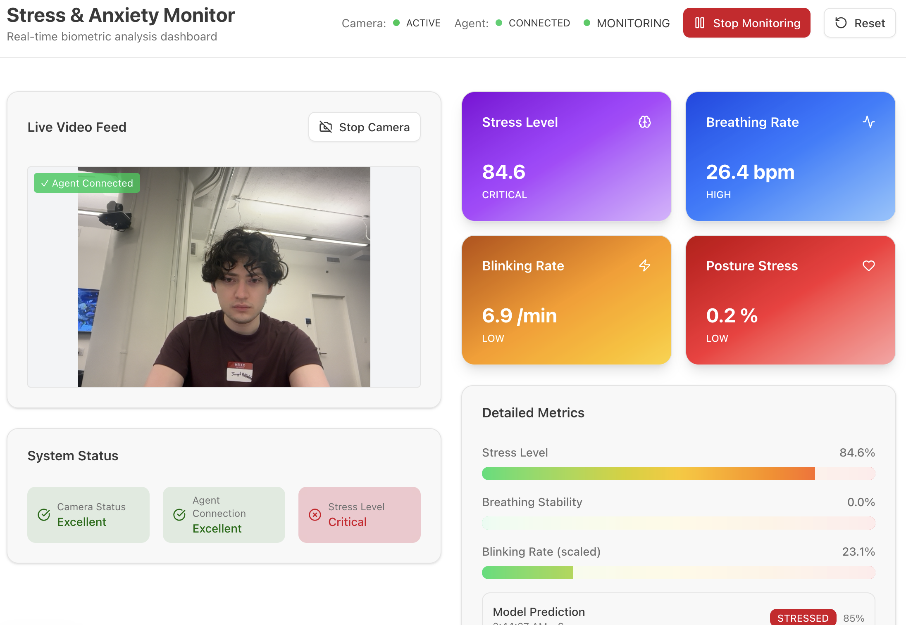
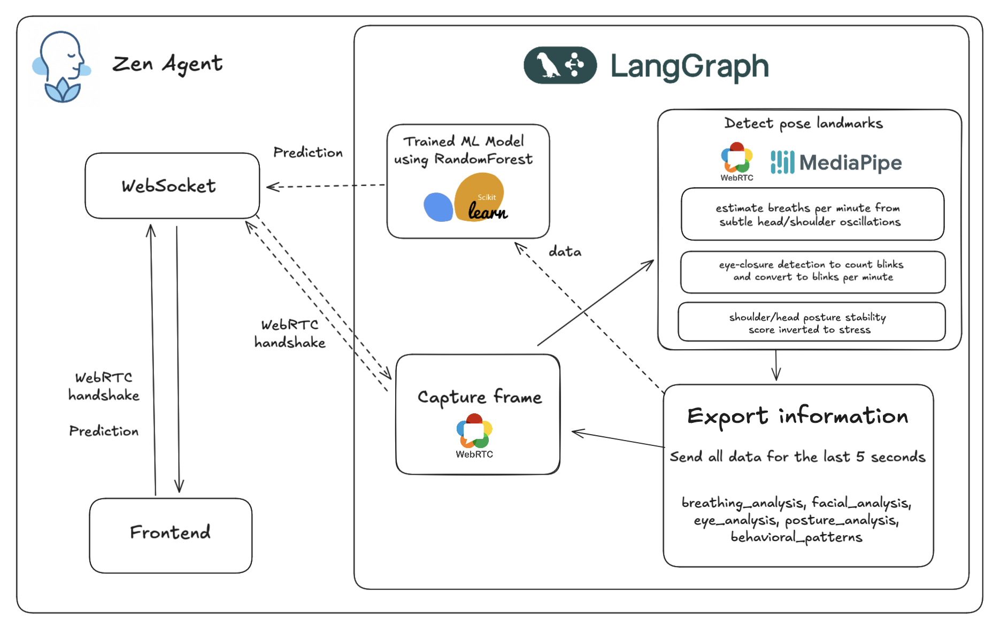

# Zen Agent

CTP Hacks 2025

Made by Joseph, Yuki, Bekbol, and Faraj

## Project Demo

## Inspiration

Stress, anxiety, and other emotions can be detrimental to people's health and well-being. We were inspired to harness technology to create a project that strives to identify any early signs of negative emotions to improve people's mindfulness.




## What It Does

Dev Agent is an AI Agent that estimates stress and mindfulness based on facial and audio indicators. It is trained on an ML model to provide assistance such as:

- Providing notifications during virtual meetings to check your emotions
- Suggesting a quick relaxation exercise to reduce stress and anxiety
- Other useful tips and information derived from your facial and vocal patterns 


## How to Run

To run the frontend, do
```bash
cd frontend
npm run dev
```
with a `.env` file with `NEXT_PUBLIC_WS_URL=ws://localhost:8765`

To run the backend, do
```bash
cd backend
python -m venv .venv
source .venv/bin/activate
pip install -r requirements.txt
python main.py
```

## How We Built It

Dev Agent was developed using the following tools and technologies:

- Next.js Frontend
- Python Backend
- LangGraph Agent
- WebRTC and WebSocket connection


    
## Challenges We Ran Into

- Connecting the backend and frontend components to get the project to deploy successfully.
- Finding the balance between too few and too many factors for the model to consider.
- Getting the dashboard to display data visualizations based on the video.
  
## Accomplishments We Are Proud Of

- Developing a modern and simple User Interface for easy use and navigation.
- Creating a trained ML model that can accurately determine emotions based on face and body cues.
- The intricacies involved in successfully fusing the frontend and backend of applications.
- Integrating agentic AI into our project to provide recommendations based on the data analyzed.
  
## What We Learned

- Being able to map face and body expressions to quantifiable measurements that our model can examine.
- How to best train ML models to prevent model overfitting and account for a broader population of data.
- The challenges encountered in processing live video in applications for a smooth, responsive user experience.
- How agentic AI can be utilized in innovative ways, such as a tool to promote better well-being and mindfulness.
    
## Future Enhancements For Dev Agent

- Developing mobile apps on iOS and Android to expand access to the Agent to more users.
- Creating a system where users can provide feedback and suggestions to improve the application.
- Potential use of Hume's API to use a model trained on millions of datapoints for more accurate analysis.
- Expand the scope of the application to include more emotions for the model to provide a wider range of recommendations.
